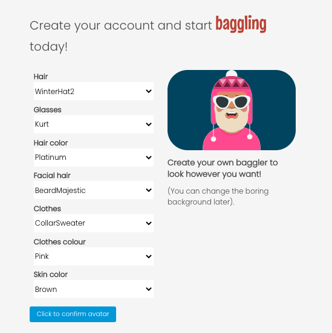

### General Assembley Software Engineering Immersive Course

# Baggle!

See Baggle! in action [here](http://gobaggle.herokuapp.com)

## Barter, bargain, haggle, BAGGLE!

### The brief

* One week
* Group of four
* **Build a full-stack application** by making your own backend and your own front-end
* **Use a Python Flask API** using a Flask REST Framework to serve your data from a Postgres database
* **Consume your API with a separate front-end** built with React
* **Be a complete product** which most likely means multiple relationships and CRUD functionality for at least a couple of models
* **Implement thoughtful user stories/wireframes** that are significant enough to help you know which features are core MVP and which you can cut
* **Have a visually impressive design** to kick your portfolio up a notch and have something to wow future clients & employers. **ALLOW** time for this.
* **Be deployed online** so it's publicly accessible.

### Technologies

* ReactJS
* Webpack
* Bulma
* Python
* Flask
* PostgreSQL
* SQLAlchemy
* Marshmallow

## The idea

### The problem

All of us have items we don't need or skills that we don't often use. In a world where everything is for sale, what if you could just... swap stuff? Baggle! is born out of the old-fashioned idea of bartering. Person A has something that Person B wants. Person B offers something in exchange - be it an item or a service. What could be simpler? 

### The solution

Instead of an e-commerce payment solution, Baggle! allows users to 'Baggle' for items. Each user (or Baggler) uploads items onto the site, rather like they would on eBay or Gumtree. Other users can then search for those items. If a user sees an item they want, they can offer one of their own items in exchange. If the exchange is accepted then the Baggle is made and the item is swapped.

## The plan

### User journey

The next step was to plan out the user journey using whiteboarding and wireframes. We knew we wanted the following functionality:

* User signup
* User registration
* User can upload (and delete) their own items
* User can upload images and associate with items
* User can view items
* User can search for items by name or distance
* User can exchange items with other users
* User can add (and remove) items to a wishlist
* User can leave comments on items
* User can view other users
* User can search for other users
* User can follow (and unfollow) other users
* User can review other users
* User can give positive or negative feedback on other users
* User can edit their own profile
* User can edit their own items
* User can create their own avatar
* User can change their profile header image

So quite a lot for a week...

## The logic

### Database relationships
Join tables and self-referencing - items self-referencing as well as users - followers, wishlists, offers
The first thing we needed to do to set up Baggle was to create a setup the back-end, endpoints and all the necessary relational databases using Python, Flask and PostgreSQL. We set up the following two main tables:

 - users
 - items

We also set up the following join tables to create relationships:
 
  * user _ items _ join (connects items with a user)
  * user _ items _ wish_ join (connects items to a user wishlist)
  * item _ offers _ join (a self-referencing join that connects items to other items that have been offerd in exchange)
  * user _ follows _ join (a self-referencing join that connets users to other users who follow them

For additional site functionality, we also set up tables to hold the following data:

* comments (user comments on items)
* images (user-uploaded images)
* reviews (user comments on other users)

This was my first time using Python, Flask and SQL but I found it easier to get my head around than the NoSQL MongoDB database we built for project 3.

We build the back-end as a team of three, but once it was all up and running and our endpoints (sort of) complete, we headed to the front-end and split the workload into chunks.

## Where I took the lead

My job on the front-end was to create all the user-specfic elements of the site:

* Sign-up
* Login
* Profile page
* Wishlist
* Follows
* User reviews
* User feedback

I also took the lead on designing the top half of the homepage and created the graphics for use on the site.

### Sign-up and avatars

We had decided early that we wanted Baggle! to have a fun theme and I was keen for the user sign-up experience to reflect this. I decided to use Avataaars, making use of the free online avataaar generator [getavataaars.com](https://getavataaars.com/), which allows users to create their own avataaars from a selection of drop-downs. This site comes with React code for using the Avataaars plugin. All I then had to do was recreate the form on my own site and insert the necessary fields into my user model to allow the user to create their own Avataaar on sign-up, which changes dynamically with their selections using React useState:

One problem I had to overcome using the Avataaars plugin was recreating the user avatar on other areas of the site, i.e the profile page and the navbar. While this was possible using the <Avatar/> component, I was finding that the formatting was often out and it was leading to page loading issues. I got around this by using the avataaars.io API and using form data to create a link that pulls directly from there using user input data:

~~~javascript
function updateAvatarData() {
    updateFormData({
      ...formData,
      avatar_hair: hair,
      avatar_accessories: accessories,
      avatar_hair_color: hairColor,
      avatar_facial_hair: facialHair,
      avatar_clothes: clothes,
      avatar_clothes_color: clothesColor,
      avatar_skin: skin,
      profile_image: `https://avataaars.io/?avatarStyle=Transparent&topType=${hair}&accessoriesType=${accessories}&hairColor=${hairColor}&facialHairType=${facialHair}&facialHairColor=${hairColor}&clotheType=${clothes}&hatColor=${clothesColor}&clotheColor=${clothesColor}&eyeType=Default&eyebrowType=Default&mouthType=Smile&skinColor=${skin}`
    })
    updateConfirmed(true)
  }
~~~

This gives each user an avatar image that is easy to manipulate and loads quickly.
 
### The profile page
I wanted the profile page act like a user hub for Baggle!, inspired by sites like Facebook where users can access most features directly from their profile page. On their profile page, users can see the following:

* User avatar and custom cover image
* An about section (username, location, bio)
* Baggles -  items the user has uploaded for bartering
* Baggling Buddies - other users the user follows
* Baggler Rating - a graph to show the percentage of good/bad feedback the user has received
* Baggle Board - comments or reviews left for that user
* Wishlist (only seen when viewing own profile) - items that the user has save to their wishlist

I was important that the user can get around easily from their profile. I created it using cards so that everything is easy to view and neatly arranged. Click on the 'See more' button on any of the cards and it will open a modal that shows you everything in that section:

The other thing that was important to me was that users could edit their own information easily and upload their own cover photos. I used an embedded edit form, that was toggled by a useState. Pressing the 'Edit' button changes editState to true, which then replaces the div in the about section to a editable form, showing the current values which can then be replaced.

~~~javascript
{editState === false ?
                  

                    

                      <label>Username</label>
                      
{profile.username}

                    

                    

                      <label>Location</label>
                      
{profile.town}

                    

                    

                      <label>Bio</label>
                      
{profile.bio}

                    

                    {profile.created_at && 
Baggling since <Moment format="Do MMM YYYY">{profile.created_at}</Moment>
}
                  
 :
                  

                    <UserUpdateForm
                      handleEditSubmit={handleEditSubmit}
                      handleEditChange={handleEditChange}
                      formData={formData}
                    />
                    
Change your cover image by uploading a photo:

                    <ImageUpload
                      formData={formData}
                      updateFormData={updateFormData}
                    />
                  

                }
~~~

In the end, the profile section ended up being a bit of a beast, and I was super pround of it, even though a lack of time towards the end meant I wasn't able to complete a few formatting issues. There were parts that we worked on as a group - most specifically the reviews section - but in general I was really happy to contribute this part of the project.

### Distances on the front-end
Our group member James worked with the Mapbox API and lat, long variables to allow users to set their own location and also to search for items by distance. I dedcided to take this further by presenting this data on the front-end so that when users search for items, it shows the item's distance from them.

This seemed easy enough in principle, we already had the latitude and longditude of each user (and by extension their associated items) captured in the database. Using Mapbox, we were also able to assign a 'town' field to each user. But I still needed a way of finding a distance between the user coordinates and the item coordinates. A bit of Googling provided a mathmatical solution to this. First, I needed to grab the search data to give me a search location. I then had to grab the lat-long from this search location and save in state. I then created a function distance() which takes the user lat-long and finds the distance to the search query lat-long using a calculation (the calculation itself is copied):

~~~javascript
function handlePlaceSelect({ placeName, location }) {
    updateselectedLocation(location)
    updateSearchResults([])
    updateSearchLocation(placeName)
    setSearchLat(searchResults[0].location.lat)
    setSearchLong(searchResults[0].location.long)
  }

  function distance(lat1, long1, lat2, long2) {
    if ((lat1 === lat2) && (long1 === long2)) {
      return 0
    } else {
      const radlat1 = Math.PI * lat1 / 180
      const radlat2 = Math.PI * lat2 / 180
      const theta = long1-long2
      const radtheta = Math.PI * theta / 180
      let distance = Math.sin(radlat1) * Math.sin(radlat2) + Math.cos(radlat1) * Math.cos(radlat2) * Math.cos(radtheta)
      if (distance > 1) {
        distance = 1
      }
      distance = Math.acos(distance)
      distance = distance * 180 / Math.PI
      distance = distance * 60 * 1.1515
      distance = distance * 1.609344
      return Math.floor(distance)
    }
  }
~~~

Using this distance function I was then able to call it in my React render, so that the card shows a distance to the user IF the user has searched for a location (otherwise the card shows the name of the town only):

~~~javascript
{searchLat !== 0 && 
{item.owner.town} || {distance(item.owner.lat, item.owner.lng, searchLat, searchLong)}km away
}
~~~

Even though the JavaScript for the distance calculation is not mine (a mathmatical genuius I am not), getting the data to be able to pass into the function as arguments was still pretty tricky and I was very proud to get this element working.

### Graphics, styling and the homepage

As a group we decided to go with Bulma as our CSS framework. Originally, we had wanted to use Bootstrap, but it was decided that we should go with familiarity as time was at a premium! I actually feel this ended up being a good thing as I am now very confident with Bulma and have pretty much read all the docs backwards! 

I took the lead on styling the top half of the homepage (including the navigation bar) and devloping the main hero graphic using [Snappa](https://snappa.com/). I also selected the fonts and developed most of the copy. 

Again, I was very happy with how this turned out and the look and feel seems in-keeping with our relaxed and fun theme.

## Next time...

### Improvements
Even though we managed to get much of our functionality working before the end of the week, there are a few obvious things that could be improved upon. Firstly, the site is not responsive and is not optimised for mobile or Safari. It works fine on a wide screen but anything less and it starts to go all wonky! Given more time, this would be the first thing I'd improve.

There are also a number of accessibility issues on the site. We could have used a lighter red to increase contrast, as I'm not sure the selected colours go well for the sight impaired. And the lack of site responsiveness means that zooming in on the browser causes issues. There are also a number of places in the site where we could have included back buttons to make navigation easier.

Lastly, I would have liked more coherent styling throughout and to ensure things like colours, button design, layout styling etc are all consistent. 

### Future additions
It would be great to introduce more complex search features for items - being able to sort and filter would be a great addition, as well as including search by category, a distance radius and maybe even search tags to make it easier to find things.

It would also be a great addition if users could look at their previous transactions and swaps, including failed transactions. This was something we planned but didn't have time to implement.

Another thing to look at would be features that Baggle! would need if it were ever used in a real-world scenario. In Baggle! the swap feature is instantaneous - accept another user's offer and your items are instantly swapped between inventories. In real-life obviously things are a little more complex! It would be good to have different statuses for offers and items. For example, once an exhange is agreed it goes into a holding space and can then be marked as completed once the items are physically exchanged. It would also be good to add a shipping and delivery options.

### Bugs squished (and not-so-squished)
Only one major bug found since deployment - when items are added to a wishlist it causes the profile page to stop loading. This is due to the code searching for the length of an array that doesn't exist when the wishlist is mapped, and should be a relatively easy fix.

### Key learning
This project taught me more than any other and really cemented a lot of knowledge in terms of back-end functions and databases. By the end of this project I really felt like I could talk around any part of it, and I was especially pleased when I was able to take existing code and not only blindly copy/paste it in, but manipulate and amend it to fit in with what I needed. I also learned the importance of getting the back-end working and all endpoints in place _before_ diving into the front-end!

## Assets
* Avatars - [getavataars.com](https://getavataaars.com/)
* Location search - [Mapbox](https://www.mapbox.com/)
* Image uploads - [Cloudify](https://cloudify.co/)
* Homepage carousel - [Slick](https://kenwheeler.github.io/slick/)
* Grpahic creation - [Snappa](https://snappa.com/)

